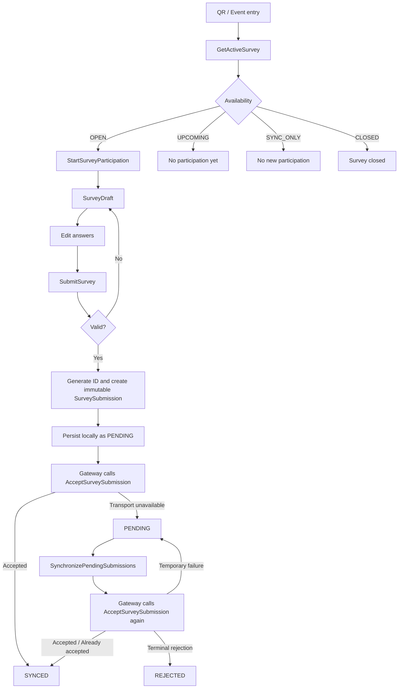
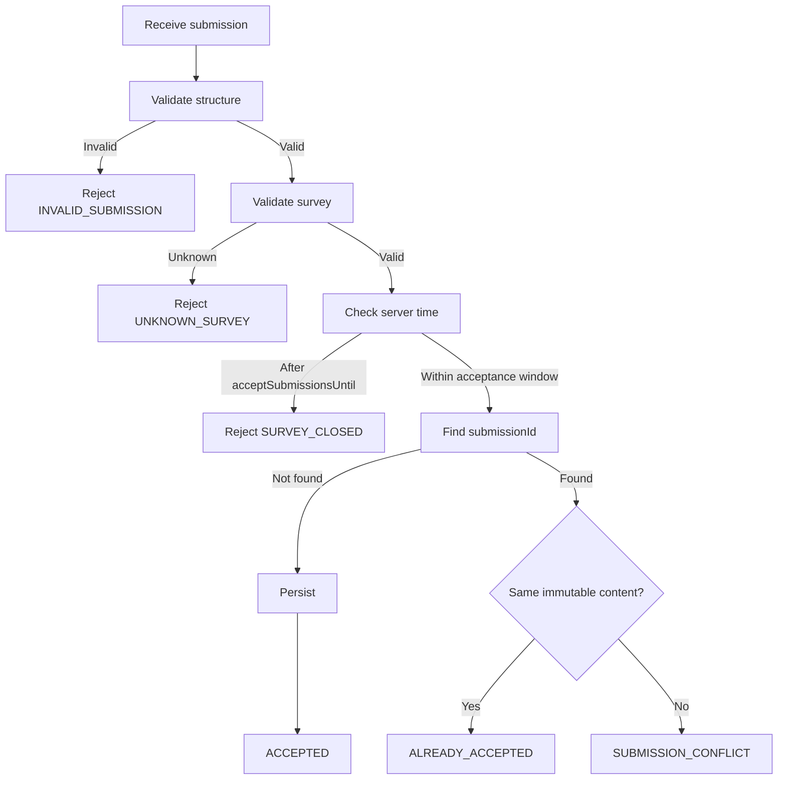

# Survey Module — Especificación funcional y técnica

**Proyecto:** Event Survey Platform  
**Documento:** Especificación funcional y técnica del módulo `survey`  
**Estado:** Núcleo implementado y verificado; integración de infraestructura pendiente
**Versión:** 0.2.0
**Fecha:** 2026-09-25

---

## 0. Propósito del documento

Este documento consolida las decisiones funcionales y técnicas adoptadas hasta este punto para el módulo `survey` de **Event Survey Platform**.

Su objetivo es servir como referencia detallada para las siguientes fases de diseño e implementación, evitando que decisiones ya tomadas queden dispersas entre conversaciones, commits o notas temporales.

Este documento:

- describe el comportamiento esperado del módulo `survey`;
- registra las decisiones funcionales ya aceptadas;
- define los principales conceptos del dominio;
- documenta los casos de uso identificados;
- consolida las invariantes funcionales;
- describe el comportamiento online y offline;
- documenta las reglas de idempotencia;
- define la política temporal de apertura, cierre y sincronización;
- diferencia dominio, estado de aplicación e infraestructura;
- identifica necesidades externas que posteriormente podrán convertirse en `ports`;
- delimita qué decisiones siguen abiertas;
- sirve como base para diseñar la estructura real de `src/modules/survey`.

Este documento **no sustituye** al documento maestro de arquitectura.

La jerarquía de referencia es:

```text
docs/architecture/MASTER_ARCHITECTURE.md
                │
                ├── ADR-001 — Modular Monolith
                ├── ADR-002 — Dependency Direction / Ports & Adapters
                │
                └── este documento
                    └── especificación detallada de survey
```

Si una decisión de implementación entra en conflicto con `MASTER_ARCHITECTURE.md`, no deberá resolverse silenciosamente en el código.

La secuencia correcta será:

```text
detectar conflicto
      ↓
analizar necesidad real
      ↓
justificar cambio
      ↓
actualizar ADR/documentación cuando corresponda
      ↓
implementar
```

---

# 1. Contexto del módulo

`survey` es la capacidad responsable del ciclo de vida funcional de una participación en una encuesta asociada a un evento.

Su responsabilidad comienza cuando la aplicación necesita conocer la encuesta correspondiente al evento y termina cuando una participación:

- ha sido aceptada y sincronizada; o
- ha sido rechazada de forma definitiva por el servidor.

El módulo debe funcionar bajo condiciones normales de conectividad y también frente a pérdida temporal de red.

La aplicación está pensada para escenarios presenciales donde una persona puede acceder mediante un QR y donde un mismo dispositivo puede ser utilizado sucesivamente por varias personas.

---

# 2. Alcance funcional

## 2.1. Responsabilidades de `survey`

El módulo es responsable de:

- obtener la definición de encuesta correspondiente a un evento;
- determinar su disponibilidad temporal;
- iniciar una participación;
- mantener un borrador editable;
- validar una participación antes de finalizarla;
- crear una `SurveySubmission` inmutable;
- asignarle un `submissionId`;
- intentar transmitirla al servidor;
- aceptar o rechazar una submission de forma autoritativa;
- garantizar idempotencia;
- mantener participaciones pendientes cuando no existe conectividad;
- sincronizar participaciones pendientes posteriormente;
- distinguir errores temporales de rechazos definitivos.

## 2.2. Fuera de alcance

El módulo no es responsable de:

- administrar la galería;
- generar informes analíticos;
- exportar hojas de cálculo;
- administrar usuarios;
- autenticar participantes;
- identificar personalmente a los encuestados;
- decidir el CMS utilizado;
- decidir la base de datos;
- decidir el ORM;
- gestionar directamente rutas Next.js;
- renderizar toda la experiencia visual del evento;
- implementar un motor universal de formularios.

Estas capacidades pertenecerán a otros módulos, capas o adaptadores.

---

# 3. Encuesta inicial

La primera encuesta utilizada para validar el producto es una encuesta POST sobre una intervención artística en el graderío de un campus universitario.

La encuesta es anónima.

## 3.1. Categoría de participante

La encuesta actual incluye una clasificación del participante:

- Estudiante;
- Profesor;
- Personal de Administración y Servicios;
- Otros.

Aunque el documento de origen lo denomina "Datos de identificación", funcionalmente no se considera información destinada a identificar a una persona concreta.

En el modelo interno se tratará como una **categoría del participante**, no como identidad.

## 3.2. Ítems Likert

La encuesta actual contiene seis dimensiones/afirmaciones:

1. Responsabilidad social y bien común.
2. Diversidad cultural.
3. Cohesión social.
4. Identidad social.
5. Inclusión social.
6. Participación social y comunitaria.

Cada ítem utiliza una escala Likert de siete valores:

| Valor | Significado |
|---:|---|
| 1 | Totalmente en desacuerdo |
| 2 | Bastante en desacuerdo |
| 3 | Algo en desacuerdo |
| 4 | Ni de acuerdo ni en desacuerdo |
| 5 | Algo de acuerdo |
| 6 | Bastante de acuerdo |
| 7 | Totalmente de acuerdo |

Solo puede seleccionarse una opción por ítem.

Todas las preguntas son obligatorias.

No existen preguntas condicionales en el alcance actual.

---

# 4. Principios funcionales adoptados

## 4.1. Una encuesta por evento

En el alcance actual:

```text
Event
  │
  └── 1 Survey
```

No se diseña todavía soporte para múltiples encuestas activas simultáneamente dentro del mismo evento.

La arquitectura podrá evolucionar si aparece un requisito real que lo justifique.

## 4.2. Encuesta estable durante el evento

La definición de la encuesta no cambia durante el periodo de participación.

No se implementará inicialmente un sistema de versionado de encuestas durante el mismo evento.

## 4.3. Anonimato

La encuesta no recopila directamente:

- nombre;
- apellidos;
- correo;
- teléfono;
- DNI/NIE;
- identificador universitario;
- cuenta de usuario.

Podría existir en el futuro un pseudónimo o nombre libre con el que una persona quiera ser mostrada, pero **no forma parte de la definición actual** y no se incorpora todavía al modelo obligatorio.

## 4.4. Dispositivo no equivale a persona

No se asume:

```text
1 dispositivo = 1 participante
```

Sí se admite:

```text
1 dispositivo = N participantes
```

Ejemplo:

```text
móvil A
├── participante 1
├── participante 2
└── participante 3
```

Cada participación deberá tener su propia identidad técnica.

## 4.5. Modificación antes del envío

Mientras la participación sea un borrador:

- se pueden cambiar respuestas;
- se puede cambiar categoría;
- puede estar incompleta.

## 4.6. Inmutabilidad después de confirmar

Cuando el participante confirma el envío:

```text
SurveyDraft
     ↓
SurveySubmission
```

la submission se considera inmutable.

No puede modificarse aunque todavía esté pendiente de sincronización.

---

# 5. Arquitectura aplicada al módulo

El módulo seguirá las reglas del documento maestro y de los ADR vigentes.

La dirección conceptual de dependencias es:

```text
presentation
     │
     ▼
application
   │     │
   ▼     ▼
domain  ports
         ▲
         │
      adapters
```

La infraestructura implementará necesidades expresadas desde la aplicación.

No se permitirá que el modelo de negocio dependa directamente de:

- Next.js;
- React;
- Payload;
- Prisma;
- PostgreSQL;
- `localStorage`;
- IndexedDB;
- `fetch`;
- objetos HTTP;
- SDKs externos.

---

# 6. Ciclo funcional completo

El ciclo inicial queda compuesto por cinco casos de uso:

| ID | Caso de uso | Responsabilidad |
|---|---|---|
| UC-SUR-01 | `SubmitSurvey` | Finalizar un borrador válido, crear una submission e intentar enviarla |
| UC-SUR-02 | `AcceptSurveySubmission` | Validar y aceptar autoritativamente una submission |
| UC-SUR-03 | `SynchronizePendingSubmissions` | Reintentar participaciones pendientes |
| UC-SUR-04 | `GetActiveSurvey` | Obtener definición y disponibilidad de la encuesta |
| UC-SUR-05 | `StartSurveyParticipation` | Iniciar un nuevo borrador editable |

Flujo global:



---

# 7. Estados

## 7.1. Estado de experiencia / participación

Los estados de interacción no deben mezclarse con los estados de sincronización.

```text
IDLE
DRAFT
```

### `IDLE`

No existe una participación activa en edición.

### `DRAFT`

Existe un borrador editable.

Puede estar incompleto.

## 7.2. Estado de sincronización de una submission

```text
PENDING
SYNCED
REJECTED
```

### `PENDING`

La participación ya es válida e inmutable, pero todavía no existe confirmación autoritativa de aceptación.

### `SYNCED`

El servidor ha confirmado que la participación está registrada.

### `REJECTED`

El servidor ha determinado que la participación no puede ser aceptada y no debe seguir reintentándose automáticamente.

---

# 8. Política temporal

Los tiempos de una encuesta serán configurables por evento.

No se codificará una duración fija ni una ventana de gracia fija dentro de los casos de uso.

## 8.1. Configuración temporal

```text
SurveySchedule
├── opensAt
├── closesAt
└── acceptSubmissionsUntil
```

Invariante:

```text
opensAt < closesAt <= acceptSubmissionsUntil
```

## 8.2. Estados derivados

La disponibilidad no se almacena como una segunda fuente de verdad.

Se deriva de los tiempos configurados.

```text
now < opensAt
→ UPCOMING
```

```text
opensAt <= now < closesAt
→ OPEN
```

```text
closesAt <= now <= acceptSubmissionsUntil
→ SYNC_ONLY
```

```text
now > acceptSubmissionsUntil
→ CLOSED
```

## 8.3. Significado

### `UPCOMING`

La encuesta existe pero todavía no acepta nuevas participaciones.

### `OPEN`

Pueden iniciarse y finalizarse nuevas participaciones.

### `SYNC_ONLY`

No pueden iniciarse ni finalizarse nuevas participaciones.

Sí pueden sincronizarse submissions ya finalizadas previamente.

### `CLOSED`

No se insertan nuevas participaciones. Un reintento idéntico de una respuesta ya persistida devuelve `ALREADY_ACCEPTED` con su `acceptedAt` original, incluso tras el cierre; esto confirma una aceptación anterior, no crea una nueva.

## 8.4. Autoridad temporal

El reloj del servidor es autoritativo.

Los timestamps del navegador pueden utilizarse como metadata diagnóstica, pero no como fuente de autorización.

`acceptedAt` será generado por el servidor.

---

# 9. Borradores

`SurveyDraft` representa el estado editable de una participación.

No se considera inicialmente una entidad del dominio.

Conceptualmente:

```text
SurveyDraft
├── surveyId
├── respondentCategoryCode?
└── partialAnswers
```

Características:

- editable mediante reemplazo del valor (propiedades `readonly`, apropiadas para estado React);
- puede estar incompleto;
- descartable;
- no necesita `submissionId`;
- no necesita identidad persistente en el alcance actual.

No se introduce `draftId` mientras no exista una necesidad concreta.

---

# 10. Finalización de una participación

La transición crítica es:

```text
SurveyDraft
     │
     │ validate + confirm
     ▼
SurveySubmission
```

Una `SurveySubmission` debe ser:

- completa;
- válida;
- inmutable;
- identificada mediante `submissionId`.

`submissionId` se genera **al finalizar la participación**, no al iniciar el borrador.

Esto evita generar identidades para borradores abandonados.

---

# 11. Identidad técnica e idempotencia

Cada nueva participación recibe un `submissionId` antes del primer intento de transporte.

Regla:

```text
1 submissionId = 1 participación inmutable
```

## 11.1. Reintento idéntico

Si el servidor ya tiene:

```text
submissionId = ABC
content = X
```

y recibe nuevamente:

```text
submissionId = ABC
content = X
```

el segundo envío es un reintento idempotente.

No se crea una nueva participación.

## 11.2. Conflicto

Si el servidor tiene:

```text
submissionId = ABC
content = X
```

y recibe:

```text
submissionId = ABC
content = Y
```

donde `X != Y`, se produce:

```text
SUBMISSION_CONFLICT
```

Nunca se actualiza ni sobrescribe la participación original.

## 11.3. Persistencia

La persistencia deberá reforzar la invariante mediante unicidad de `submissionId`.

La comprobación lógica por sí sola no es suficiente frente a concurrencia.

---

# 12. Comportamiento offline

Una submission completada no se considera inválida solo porque no exista conectividad.

Si el transporte falla temporalmente:

```text
SurveySubmission
      ↓
PENDING
```

La participación se conserva localmente para sincronización posterior.

## 12.1. Cola, no slot único

No se utilizará:

```text
pendingSubmission
```

como único valor sobrescribible.

Se necesita conceptualmente:

```text
pendingSubmissions[]
```

porque un mismo dispositivo puede ser utilizado por varias personas durante una interrupción de conectividad.

Ejemplo:

```text
pendingSubmissions
├── submission A
├── submission B
└── submission C
```

Cada una mantiene su propia identidad.

---

# 13. Sincronización de pendientes

La primera política de procesamiento será FIFO:

```text
A → B → C
```

FIFO es una política inicial de aplicación, no una invariante de dominio.

## 13.1. Procesamiento independiente

El fallo específico de una submission no debe bloquear permanentemente las demás.

## 13.2. Clasificación de resultados

| Resultado | Estado local | Reintento |
|---|---|---|
| `ACCEPTED` | `SYNCED` | No |
| `ALREADY_ACCEPTED` | `SYNCED` | No |
| Sin conexión | `PENDING` | Sí |
| Timeout | `PENDING` | Sí |
| Error temporal de servidor | `PENDING` | Sí |
| `SUBMISSION_CONFLICT` | `REJECTED` | No |
| `INVALID_SUBMISSION` | `REJECTED` | No |
| `UNKNOWN_SURVEY` | `REJECTED` | No |
| `SURVEY_CLOSED` | `REJECTED` | No |

## 13.3. Fallo de transporte

Si se detecta una indisponibilidad general del transporte:

```text
A → SYNCED
B → timeout
C → no procesada
D → no procesada
```

el ciclo actual puede detenerse.

No tiene sentido continuar haciendo peticiones si la conectividad general se ha perdido.

## 13.4. Rechazo específico

Si:

```text
A → SYNCED
B → SUBMISSION_CONFLICT
C → ...
```

`B` se marca `REJECTED` y el proceso puede continuar con `C`.

## 13.5. Exclusión de sincronizaciones concurrentes

En una misma instancia cliente solo debe existir un ciclo local de sincronización activo en un momento dado.

La idempotencia del servidor sigue siendo la defensa final frente a carreras o reintentos duplicados.

## 13.6. Número de reintentos

No se fija inicialmente:

```text
MAX_RETRIES = N
```

Una submission válida no debe descartarse automáticamente por haber sufrido un número arbitrario de fallos de conectividad.

Podrán introducirse estrategias de backoff como preocupación técnica posterior.

---

# 14. Aceptación autoritativa en servidor

`AcceptSurveySubmission` es el punto autoritativo que decide si una participación puede registrarse.

El servidor debe volver a validar toda entrada.

La validación del cliente es únicamente UX.

## 14.1. Flujo



## 14.2. No existe actualización de submissions aceptadas

No se implementará conceptualmente:

```text
upsertSubmission
```

si esa operación permite sobrescribir contenido ya aceptado.

La semántica correcta es:

```text
accept once
retry idempotently
never mutate accepted content
```

---

# 15. Caso de uso UC-SUR-01 — `SubmitSurvey`

## Objetivo

Convertir un borrador válido en una submission inmutable e intentar su sincronización.

## Precondiciones

- existe un `SurveyDraft`;
- la encuesta sigue `OPEN`;
- el usuario confirma el envío.

## Validación

Debe existir:

- una categoría válida;
- una respuesta para cada ítem;
- ninguna respuesta desconocida;
- ninguna respuesta duplicada;
- valores Likert válidos.

## Flujo normal

```text
SurveyDraft
   ↓
validate
   ↓
generate submissionId
   ↓
create SurveySubmission
   ↓
savePending (durable before sending)
   ↓
attempt transport
   ├── success → SYNCED
   └── temporary transport failure → PENDING
```

## Postcondición

La submission ya no puede editarse.

---

# 16. Caso de uso UC-SUR-02 — `AcceptSurveySubmission`

## Objetivo

Aceptar una submission una sola vez y garantizar idempotencia.

## Responsabilidades

- validar entrada;
- validar encuesta;
- validar disponibilidad temporal autoritativa;
- verificar `submissionId`;
- detectar reintento idéntico;
- detectar conflicto;
- persistir una sola vez;
- generar `acceptedAt`.

## Resultados funcionales

```text
ACCEPTED
ALREADY_ACCEPTED
INVALID_SUBMISSION
UNKNOWN_SURVEY
SURVEY_CLOSED
SUBMISSION_CONFLICT
```

Para la UI cliente, `ACCEPTED` y `ALREADY_ACCEPTED` pueden tratarse como éxito equivalente.

---

# 17. Caso de uso UC-SUR-03 — `SynchronizePendingSubmissions`

## Objetivo

Procesar participaciones finalizadas cuyo registro servidor no está confirmado.

## Comportamiento

- leer pendientes;
- procesarlas inicialmente en FIFO;
- tratar cada submission de forma independiente;
- marcar éxito como `SYNCED`;
- mantener fallos temporales como `PENDING`;
- marcar rechazos permanentes como `REJECTED`;
- detener el ciclo si existe fallo general de transporte;
- evitar dos ciclos simultáneos en el mismo cliente.

---

# 18. Caso de uso UC-SUR-04 — `GetActiveSurvey`

## Objetivo

Obtener la encuesta asociada al evento y su disponibilidad actual.

## Entrada conceptual

```text
eventId
```

## Resultado conceptual

```text
Survey
+
SurveyAvailability
```

## Comportamiento temporal

La disponibilidad deberá calcularse utilizando tiempo autoritativo del servidor.

Errores conceptuales que deberán poder diferenciarse internamente:

```text
EVENT_NOT_FOUND
SURVEY_NOT_CONFIGURED
```

La UI pública podrá decidir mostrar mensajes equivalentes si la experiencia lo requiere.

---

# 19. Caso de uso UC-SUR-05 — `StartSurveyParticipation`

## Objetivo

Crear un nuevo borrador editable cuando la encuesta está abierta.

## Precondición

```text
SurveyAvailability = OPEN
```

## Resultado

```text
SurveyDraft
```

## Dispositivo compartido

La existencia de submissions previas en el mismo dispositivo no bloquea una nueva participación.

La UI puede ofrecer explícitamente:

```text
Otra persona quiere responder
```

lo que genera un nuevo borrador independiente.

## Cierre durante edición

Si una participación se inició antes de `closesAt` pero se intenta finalizar después:

```text
no debe convertirse en nueva SurveySubmission
```

La ventana `SYNC_ONLY` está reservada para submissions ya finalizadas, no para prolongar borradores indefinidamente.

---

# 20. Modelo de dominio inicial

## 20.1. `Survey`

`Survey` es el aggregate root de la definición de encuesta.

Conceptualmente:

```text
Survey
├── id: SurveyId
├── eventId: EventId
├── title
├── instructions
├── schedule: SurveySchedule
├── respondentCategories[]
└── items[]
```

Tiene identidad propia y pertenece a un evento.

## 20.2. `SurveySchedule`

Value Object:

```text
SurveySchedule
├── opensAt
├── closesAt
└── acceptSubmissionsUntil
```

Responsabilidad:

- proteger invariantes temporales;
- derivar `SurveyAvailability`.

## 20.3. `SurveyAvailability`

Tipo derivado:

```text
UPCOMING
OPEN
SYNC_ONLY
CLOSED
```

No debe persistirse como una fuente de verdad independiente si puede calcularse a partir del schedule.

## 20.4. `LikertItem`

Concepto perteneciente a `Survey`.

```text
LikertItem
├── code
├── dimension
├── statement
└── order
```

Inicialmente se trata como Value Object interno de la definición de encuesta.

No posee ciclo de vida independiente.

## 20.5. `LikertValue`

Valor limitado a:

```text
1 | 2 | 3 | 4 | 5 | 6 | 7
```

No es obligatorio convertirlo en clase si TypeScript y la validación de límites pueden proteger correctamente la restricción.

## 20.6. `RespondentCategoryOption`

Las categorías no se codifican como enum global de plataforma.

Cada encuesta define sus propias opciones.

Ejemplo actual:

```text
student
professor
administration-services
other
```

Cada opción puede contener:

```text
code
label
```

## 20.7. `LikertAnswer`

```text
LikertAnswer
├── itemCode
└── value
```

No se codificarán propiedades permanentes como:

```text
socialResponsibility
culturalDiversity
socialCohesion
...
```

porque esos nombres pertenecen a la encuesta actual, no a la plataforma.

## 20.8. `SurveySubmission`

Aggregate root independiente.

```text
SurveySubmission
├── submissionId
├── surveyId
├── respondentCategoryCode
└── answers[]
```

La identidad viene dada por `SubmissionId`.

Dos submissions con el mismo contenido y distintos IDs siguen representando participaciones diferentes.

## 20.9. Separación de aggregates

No se modelará:

```text
Survey
└── submissions[]
```

como un agregado gigante.

La relación es:

```text
SurveySubmission
      │
      └── surveyId → Survey
```

`Survey` y `SurveySubmission` son aggregate roots independientes.

---

# 21. Conceptos que no pertenecen al dominio central

## 21.1. `SurveyDraft`

Pertenece a estado de aplicación/interacción.

## 21.2. `SubmissionSyncState`

```text
PENDING
SYNCED
REJECTED
```

describe la relación operativa con el servidor, no la esencia de la participación.

## 21.3. `LocalSubmissionRecord`

Conceptualmente puede envolver:

```text
LocalSubmissionRecord
├── submission
├── syncState
└── metadata operativa
```

Será útil para almacenamiento local.

## 21.4. `acceptedAt`

Es metadata autoritativa de aceptación servidor.

No forma parte del contenido proporcionado por el participante.

## 21.5. `completedAtClient`

Podrá existir como metadata diagnóstica.

No será autoritativa para decidir aceptación temporal.

---

# 22. Invariantes consolidadas

## INV-SUR-01

`submissionId` identifica exactamente una participación.

## INV-SUR-02

Una participación aceptada es inmutable.

## INV-SUR-03

Repetir la misma submission no crea duplicados.

## INV-SUR-04

El mismo `submissionId` con contenido diferente produce conflicto.

## INV-SUR-05

Una submission solo puede aceptarse si cumple la definición de su encuesta.

## INV-SUR-06

La persistencia debe garantizar unicidad de `submissionId`.

## INV-SUR-07

La disponibilidad temporal se deriva de `opensAt`, `closesAt` y `acceptSubmissionsUntil`.

## INV-SUR-08

El servidor no acepta submissions nuevas después de `acceptSubmissionsUntil`.

## INV-SUR-09

Los timestamps del cliente no constituyen autoridad temporal.

## INV-SUR-10

`acceptedAt` es generado por el servidor.

## INV-SUR-11

Una submission pendiente permanece inmutable durante todos sus reintentos.

## INV-SUR-12

`ACCEPTED` y `ALREADY_ACCEPTED` producen localmente el mismo resultado: `SYNCED`.

## INV-SUR-13

Los errores temporales no convierten una submission válida en `REJECTED`.

## INV-SUR-14

Los rechazos definitivos detienen los reintentos automáticos de esa submission.

## INV-SUR-15

El fallo de una submission no impide procesar las siguientes, salvo si el fallo representa indisponibilidad general del transporte.

## INV-SUR-16

Una instancia cliente no debe ejecutar dos ciclos de sincronización local simultáneamente.

## INV-SUR-17

Solo se puede iniciar una nueva participación cuando la encuesta está `OPEN`.

## INV-SUR-18

Un `SurveyDraft` es editable y puede estar incompleto.

## INV-SUR-19

Un `SurveyDraft` no es una `SurveySubmission`.

## INV-SUR-20

`submissionId` se genera al finalizar una participación, no al iniciar el borrador.

## INV-SUR-21

La existencia de participaciones previas en el mismo dispositivo no impide una nueva participación.

## INV-SUR-22

Después de `closesAt` no se pueden finalizar nuevas participaciones; solo sincronizar submissions ya finalizadas hasta `acceptSubmissionsUntil`.

## INV-SUR-23

Los códigos de ítems dentro de una encuesta deben ser únicos.

## INV-SUR-24

Los códigos de categorías dentro de una encuesta deben ser únicos.

## INV-SUR-25

Una submission debe contener exactamente una respuesta por cada ítem definido por su encuesta.

## INV-SUR-26

Una submission no puede contener ítems desconocidos.

## INV-SUR-27

Una submission no puede contener respuestas duplicadas para el mismo `itemCode`.

## INV-SUR-28

Todo `LikertValue` debe pertenecer al rango permitido por el modelo actual: `1..7`.

## INV-SUR-29

La categoría seleccionada debe existir dentro de `respondentCategories` de la encuesta correspondiente.

---

# 23. Necesidades externas descubiertas

Los casos de uso han revelado necesidades reales que posteriormente podrán convertirse en `ports`.

Los contratos implementados se detallan en la sección 34; las tecnologías siguen abiertas.

## 23.1. Obtención de encuesta

Necesidad:

```text
obtener Survey por eventId
```

Contrato implementado:

```text
SurveyProvider
```

## 23.2. Persistencia autoritativa de submissions

Necesidades:

```text
findById(submissionId)
saveIfAbsent(record) — inserción atómica o registro existente
```

Contrato implementado:

```text
SurveySubmissionRepository
```

## 23.3. Transporte cliente → servidor

Necesidad:

```text
enviar SurveySubmission
recibir resultado de aceptación
```

Contrato implementado:

```text
SurveySubmissionGateway
```

## 23.4. Almacenamiento local de submissions

Necesidades:

```text
guardar submission local
listar pendientes
marcar synced
marcar rejected
```

Contrato implementado:

```text
LocalSubmissionStore
```

frente a un contrato demasiado limitado como:

```text
PendingSubmissionStore
```

porque el estado local puede contener `PENDING`, `SYNCED` y `REJECTED`.

## 23.5. Generación de IDs

Necesidad:

```text
generar SubmissionId único
```

El dominio no deberá depender de UUID/ULID concreto.

## 23.6. Fuente de tiempo

Necesidad:

```text
obtener tiempo autoritativo
```

Se inyecta `now: Date` en cada ejecución, sin port de reloj adicional. En servidor lo aporta la composición confiable; nunca se toma del cuerpo HTTP. En cliente requiere una política de estimación basada en tiempo servidor, aún pendiente de integración.

---

# 24. Fronteras de confianza y seguridad

## 24.1. Cliente no confiable

Toda entrada procedente del navegador debe considerarse no confiable.

El cliente puede validar para UX, pero el servidor debe validar de nuevo.

## 24.2. Nunca confiar en objetos tecnológicos externos

Los modelos de:

- Payload;
- Prisma;
- SDKs;
- respuestas HTTP;

no deben propagarse directamente hacia el dominio.

Los adaptadores deberán mapearlos a modelos internos.

## 24.3. Unicidad autoritativa

La idempotencia debe estar protegida:

- por reglas de aplicación;
- por restricción de persistencia.

## 24.4. Datos personales

No se recopilarán datos directamente identificativos en el alcance actual.

La incorporación futura de datos personales requerirá revisión explícita del modelo, seguridad y privacidad.

---

# 25. Errores y resultados conceptuales

Los errores concretos podrán modelarse posteriormente, pero funcionalmente se han identificado:

```text
EVENT_NOT_FOUND
SURVEY_NOT_CONFIGURED
SURVEY_NOT_OPEN
SURVEY_CLOSED
INVALID_SUBMISSION
UNKNOWN_SURVEY
SUBMISSION_CONFLICT
TRANSPORT_UNAVAILABLE
TEMPORARY_SERVER_FAILURE
```

Resultados positivos:

```text
ACCEPTED
ALREADY_ACCEPTED
SYNCED
PENDING
```

Estado terminal negativo:

```text
REJECTED
```

No todos estos nombres tienen que convertirse en clases o enums independientes.

El diseño de tipos final deberá mantener solo las distinciones que sean necesarias para comportamiento real.

---

# 26. Decisiones deliberadamente no tomadas

Las siguientes cuestiones permanecen abiertas y **no deben asumirse en código todavía**:

- Payload como CMS definitivo;
- Prisma como ORM;
- PostgreSQL como base de datos definitiva;
- `localStorage` frente a IndexedDB u otro mecanismo;
- UUID frente a ULID para `submissionId`;
- representación física de `eventId` y `surveyId`;
- formato final de los contratos HTTP;
- uso de Zod u otra librería de validación;
- estrategia exacta de backoff;
- tiempo de retención local de registros `REJECTED`;
- necesidad futura de pseudónimo;
- soporte futuro de otros tipos de pregunta;
- versionado futuro de encuesta;
- múltiples encuestas por evento;
- mecanismo administrativo para editar configuración temporal;
- infraestructura concreta para reporting.

Estas decisiones deberán tomarse únicamente cuando exista suficiente contexto y justificación.

---

# 27. Decisiones rechazadas por ahora

No se implementará inicialmente:

```text
Question base class
QuestionType universal
FormEngine
SurveyVersion
Respondent entity
Participant identity
Device identity
DraftId
microservices
micro-frontends
generic repository base class
global RespondentCategory enum
hard-coded fields for current six survey dimensions
```

La razón general es YAGNI y la necesidad de preservar un modelo proporcional al problema real.

---

# 28. Estrategia de pruebas derivada del modelo

Se usa el runner integrado de Node y TypeScript ya instalado mediante `pnpm test:survey`, sin dependencias nuevas. Las pruebas aisladas verifican los contratos con dobles en memoria; los adaptadores reales necesitarán pruebas propias. Cobertura requerida:

## 28.1. `SurveySchedule`

- `opensAt >= closesAt` debe fallar;
- `closesAt > acceptSubmissionsUntil` debe fallar;
- derivación de `UPCOMING`;
- derivación de `OPEN`;
- derivación de `SYNC_ONLY`;
- derivación de `CLOSED`;
- comportamiento en los límites temporales.

## 28.2. Validación de `Survey`

- item codes duplicados;
- category codes duplicados.

## 28.3. Validación de `SurveySubmission`

- falta categoría;
- categoría desconocida;
- falta respuesta;
- respuesta duplicada;
- ítem desconocido;
- Likert < 1;
- Likert > 7;
- exactamente una respuesta por ítem.

## 28.4. Idempotencia

- ID nuevo + contenido válido → `ACCEPTED`;
- mismo ID + mismo contenido → `ALREADY_ACCEPTED`;
- mismo ID + contenido distinto → `SUBMISSION_CONFLICT`;
- concurrencia → una única persistencia autoritativa.

## 28.5. Offline

- fallo de transporte → `PENDING`;
- accepted → `SYNCED`;
- already accepted → `SYNCED`;
- rejection terminal → `REJECTED`;
- error temporal mantiene `PENDING`;
- fallo de transporte general detiene ciclo;
- rechazo específico permite continuar;
- múltiples participaciones del mismo dispositivo permanecen independientes.

## 28.6. Cierre

- nueva participación antes de `opensAt` → no permitida;
- durante `OPEN` → permitida;
- nueva finalización después de `closesAt` → no permitida;
- submission pendiente durante `SYNC_ONLY` → sincronizable;
- después de `acceptSubmissionsUntil` → rechazo autoritativo.

---

# 29. Trazabilidad hacia implementación

La implementación deberá surgir desde este orden:

```text
requisitos
  ↓
casos de uso
  ↓
invariantes
  ↓
modelo
  ↓
ports
  ↓
adapters
  ↓
tecnología
  ↓
persistencia física
```

No deberá invertirse como:

```text
tabla
↓
modelo ORM
↓
service
↓
caso de uso
```

La estructura física verificada se documenta en la sección 34.

---

# 30. Convención de archivos

Todo archivo de código mantenido por el proyecto deberá comenzar con un encabezado breve.

Orden:

1. ruta relativa;
2. responsabilidad;
3. restricción arquitectónica opcional.

Ejemplo:

```ts
// src/modules/survey/domain/SurveySubmission.ts
// Represents an immutable completed survey participation.
```

Ejemplo con restricción:

```ts
// src/modules/survey/adapters/browser/BrowserLocalSubmissionStore.ts
// Persists local submission records for offline synchronization.
// Browser-specific storage details must not escape this adapter.
```

No se modifican archivos generados automáticamente para cumplir esta convención.

---

# 31. Relación con README

Este documento contiene el detalle técnico.

`README.md` deberá conservar únicamente la información necesaria para entender rápidamente:

- qué es Event Survey Platform;
- arquitectura general;
- cómo ejecutar el proyecto;
- principales módulos;
- comportamiento esencial de `survey`;
- decisiones de alto nivel;
- enlaces a documentación detallada.

El README no debe duplicar esta especificación.

Resumen candidato para README:

```text
Survey
- One active survey per event in the initial scope.
- Anonymous responses with no directly identifying personal data.
- Current survey model supports required 1–7 Likert items.
- Survey definitions and respondent categories are data-driven within that constrained model.
- Drafts remain editable until final submission.
- Finalized submissions are immutable and use a client-generated submissionId.
- Server acceptance is idempotent and authoritative.
- One device may be used by multiple participants.
- Offline submissions are queued and synchronized later.
- Synchronization states are PENDING, SYNCED and REJECTED.
- opensAt, closesAt and acceptSubmissionsUntil are configurable per survey/event.
- Survey and SurveySubmission are separate aggregate roots.
```

---

# 32. Gobierno del documento

Este documento es un **living technical specification**.

Debe actualizarse cuando cambie de forma material:

- un caso de uso;
- una invariante;
- el modelo de dominio;
- la semántica de sincronización;
- la política temporal;
- la privacidad;
- la idempotencia;
- el límite funcional del módulo.

No hace falta actualizarlo por:

- refactors internos sin cambio funcional;
- nombres locales triviales;
- cambios estéticos;
- modificaciones puramente mecánicas.

Si un cambio afecta una decisión arquitectónica transversal, también deberá evaluarse si requiere:

- actualizar `MASTER_ARCHITECTURE.md`;
- modificar un ADR existente;
- crear un nuevo ADR.

---

# 33. Estado de la revisión secuencial — 2026-09-25

1. **Inventario:** existen 3 archivos de dominio, 6 de aplicación (cinco casos de uso
   y el borrador) y 5 puertos. La versión 0.1 no contenía un árbol físico prescriptivo;
   estaba desactualizada respecto a la implementación, no incumplida por ese árbol.
2. **Lógica:** pruebas de los cinco casos de uso, fronteras temporales, validación,
   cola, concurrencia e idempotencia. Se corrigieron la disponibilidad caducada y
   la confirmación idempotente tras el cierre.
3. **API pública:** `src/modules/survey/index.ts` expone símbolos explícitos para
   composición, modelos y contratos. No exporta helpers internos ni infraestructura.

El núcleo es verificable en memoria. No constituye todavía una encuesta funcional
integrada en la web: faltan adaptadores, transporte, composición y presentación.

# 34. Estructura física y contratos verificados

```text
src/modules/survey/
├── index.ts
├── domain/
│   ├── survey.ts
│   ├── survey-schedule.ts
│   └── survey-submission.ts
├── application/
│   ├── survey-draft.ts
│   ├── get-active-survey/get-active-survey.ts
│   ├── start-survey-participation/start-survey-participation.ts
│   ├── submit-survey/submit-survey.ts
│   ├── accept-survey-submission/accept-survey-submission.ts
│   └── synchronize-pending-submissions/synchronize-pending-submissions.ts
└── ports/
    ├── survey-provider.port.ts
    ├── survey-submission-repository.port.ts
    ├── survey-submission-gateway.port.ts
    ├── local-submission-store.port.ts
    └── submission-id-generator.port.ts
```

No se crean carpetas vacías de adapters/presentation. Las pruebas están en
`tests/survey.test.ts`; `scripts/test-survey.mjs` compila en una carpeta temporal,
ejecuta Node y elimina únicamente esa carpeta temporal.

| Caso | Entrada y dependencias | Salida / conexión |
|---|---|---|
| UC-SUR-04 | `eventId`, `now`; `SurveyProvider` | `FOUND` con Survey y disponibilidad, `EVENT_NOT_FOUND` o `SURVEY_NOT_CONFIGURED` |
| UC-SUR-05 | `survey`, `now` | `STARTED` con borrador vacío o `SURVEY_NOT_OPEN` |
| UC-SUR-01 | `survey`, `draft`, `now`; generador, store, gateway | `INVALID_DRAFT`, `SURVEY_NOT_OPEN`, `SYNCED`, `PENDING` o `REJECTED` |
| UC-SUR-02 | contenido tipado y `now`; provider y repository | `ACCEPTED`, `ALREADY_ACCEPTED` o `REJECTED` con motivo |
| UC-SUR-03 | store y gateway; fábrica de sincronizador | `COMPLETED` o `INTERRUPTED` con contadores y motivo reintentable |

La secuencia no es una llamada lineal única: Submit y Synchronize usan el mismo
Gateway; el adaptador de transporte conectará ambos con Accept en servidor.
Un envío online aceptado no necesita pasar por Synchronize.

## 34.1. Decisiones de implementación conservadas

- Identificadores opacos representados mediante strings nominales y constructores;
  el formato UUID/ULID sigue sin imponerse.
- `SurveySchedule` encapsula milisegundos y devuelve copias de Date; el dominio
  valida fechas y límites sin consultar relojes externos.
- Borradores editables mediante nuevos valores; submissions congeladas junto
  con su array de respuestas y cada respuesta. La edición posterior del borrador
  no modifica el contenido pendiente.
- `SurveyProvider` reúne búsqueda por evento y por survey, preservando resultados
  diferentes para evento inexistente y encuesta sin configurar.
- Persistencia local antes del transporte: una respuesta solo puede anunciarse
  como pendiente durable después de resolver `savePending`.
- `findById` reconoce aceptaciones previas antes de evaluar la ventana para una
  inserción nueva; `saveIfAbsent` sigue siendo atómico para cerrar la carrera
  entre consulta e inserción. No puede reemplazarse por consultar y guardar.
- La igualdad de contenido ignora el orden de respuestas; distintos IDs siguen
  representando participaciones distintas. Un conflicto nunca sobrescribe datos.
- `now` sustituye a una disponibilidad aportada por el consumidor en Start/Submit:
  se recalcula en cada acción y no se reutiliza el `OPEN` observado al cargar.
- Gateway normaliza red/timeout a `TRANSPORT_UNAVAILABLE` y fallos temporales
  generales a `TEMPORARY_SERVER_FAILURE`; ambos interrumpen este ciclo FIFO.
  Los rechazos de una respuesta permiten continuar con las siguientes.
- Los errores inesperados y fallos de almacenamiento se propagan. No equivalen
  a éxito ni rechazo definitivo. Si falla markSynced, la respuesta sigue pendiente
  y recupera la confirmación mediante el mismo ID, sin volver a finalizar el draft.
- El sincronizador comparte la promesa activa y libera el bloqueo también ante
  una excepción. La composición debe reutilizar una instancia por cliente/store.
  No es un bloqueo entre pestañas ni entre instancias creadas por separado.
- SYNCED/REJECTED salen del conjunto pendiente; la retención o eliminación física
  se define en el adaptador. No se pierde otra respuesta al iniciar un nuevo draft.

## 34.2. API pública controlada

Los consumidores externos importan desde `@/modules/survey`. El índice usa
exports nominales y `export type`, nunca `export *`. La frontera expone:

- los cinco casos de uso;
- inputs, results y tipos de validación necesarios para interpretar resultados;
- modelos y tipos necesarios para consumir la capacidad;
- constructores de identificadores nominales como operaciones públicas de entrada;
- tipos `*Dependencies` para composición explícita de los casos de uso.

Se excluyen errores internos (clases de excepción), helpers de validación/comparación,
fábricas de agregados/borradores, puertos de repositorio, almacenamiento local,
provider, gateway, generador de IDs y adaptadores concretos. Los errores funcionales
contenidos en results sí son públicos: la UI necesita poder interpretarlos.

Los tipos de resultado actualmente declarados junto al gateway siguen siendo
contratos públicos de aplicación; exportarlos no exporta `SurveySubmissionGateway`.
Los tipos `*Dependencies` describen estructuralmente puertos internos: el índice
reduce exports directos, pero no los vuelve inaccesibles por reflexión de tipos.
No es una frontera de seguridad ni una fachada que oculte la inyección.

Los adaptadores del propio módulo pueden importar sus puertos internamente.
Las pruebas unitarias pueden importar fábricas y puertos para construir fixtures
y dobles en memoria; invocan los casos de uso desde el índice público. Esta excepción
no autoriza imports internos desde otros módulos o desde presentación externa.
La composición futura deberá resolverse en el borde con una entrada específica
cuando existan adaptadores reales, sin reexportarlos desde este índice compartido.

Accept debe invocarse desde composición de servidor; su exportación no permite
sustituir la aceptación autoritativa por una llamada ejecutada en el navegador.

## 34.3. Límites pendientes antes de producción

- Validar y normalizar el cuerpo HTTP como `unknown`, IDs incluidos, antes de
  construir los inputs tipados; los tipos nominales no validan JSON por sí solos.
- Implementar provider, almacenamiento local durable, gateway, repositorio con
  unicidad real y generación de IDs. Probar la atomicidad en la base de datos elegida.
- Obtener tiempo servidor confiable para Get/Accept; definir actualización y
  estimación de tiempo para Start/Submit offline. Pasar `now` evita un estado
  caducado pero no convierte el reloj del navegador en una autoridad.
- En SYNC_ONLY el servidor acepta contenido válido hasta el límite de aceptación.
  Sin prueba de finalización previa, no puede distinguir una respuesta offline
  legítima de una nueva creada por un cliente modificado. INV-SUR-22 queda aplicada
  en Start/Submit; su garantía adversarial en servidor sigue pendiente de decisión.
  No se fingirá resolverla con un timestamp del cliente.
- Reutilizar el sincronizador, impedir doble confirmación del mismo borrador y
  retener su submissionId para reintentos ante errores posteriores a savePending.
  Definir coordinación entre pestañas si se requiere; la fábrica actual no la ofrece.
- Resolver recuperación de fallos de almacenamiento, retención y backoff, validación
  del transporte, rate limiting, composición HTTP y formulario accesible.
- La definición de encuesta debe mantenerse recuperable para comprobar reintentos
  de respuestas aceptadas; archivar no debe eliminarla silenciosamente.

Véase `docs/architecture/decisions/ADR-009-survey-lifecycle-contracts.md`.
